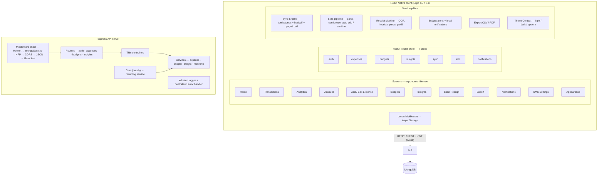
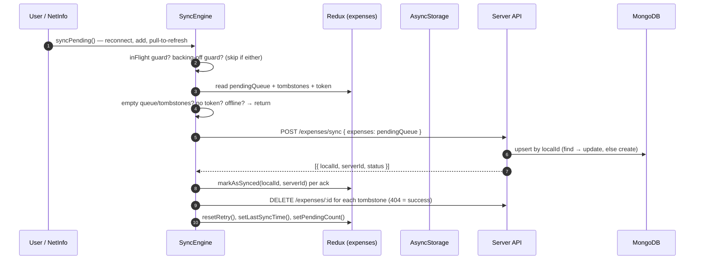
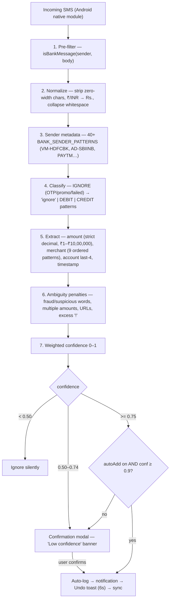
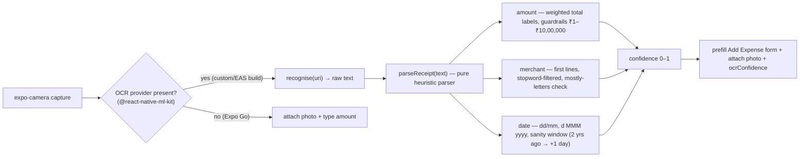
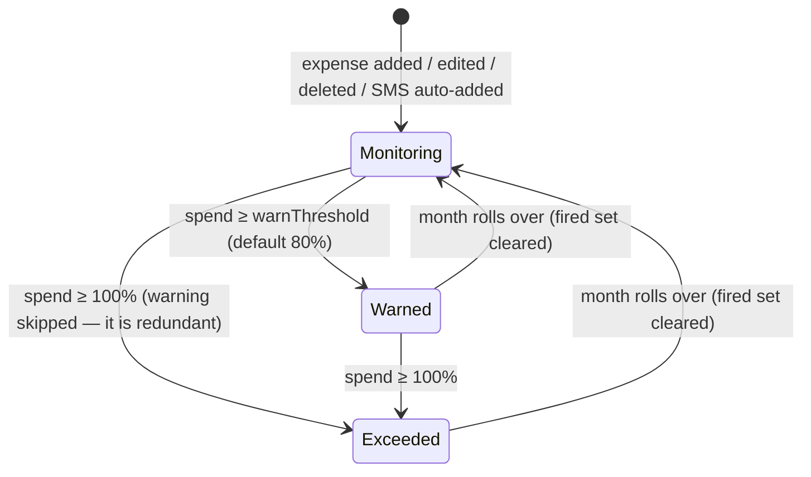
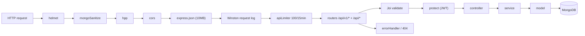
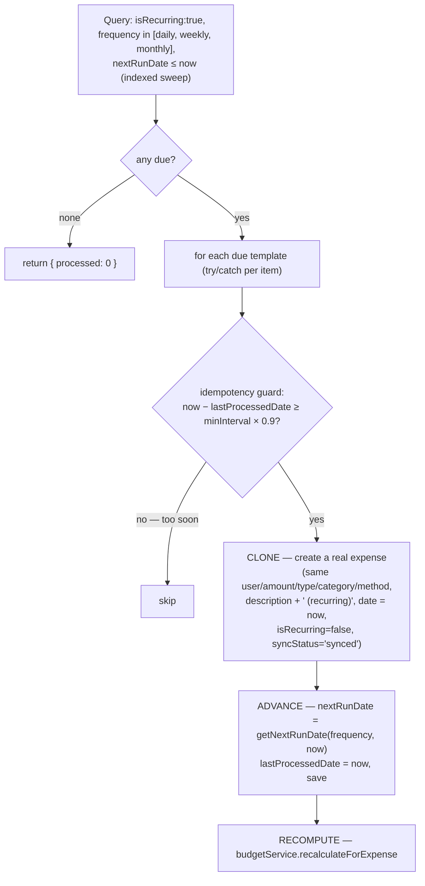
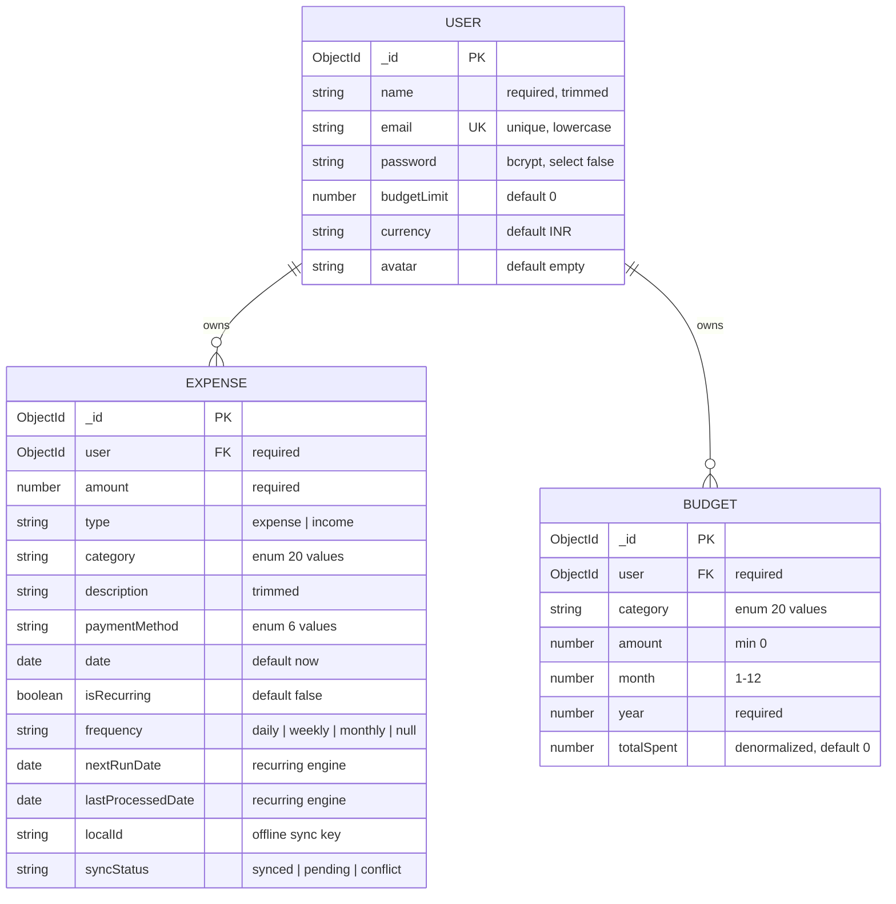

# PocketExpense+ — Complete Study Guide (v2)

**Last updated:** 28 August 2026 · tracks the current `master` revision.

**Covers:** the full system — what it is, why every major technology was chosen, the architecture (with Mermaid diagrams), the algorithms, the database design and rationale, security, testing, deployment, trade-offs behind every decision, known limitations, and exam-prep questions.

**Project:** a full-stack, offline-first expense tracking app — **React Native (Expo)** mobile client + **Node.js/Express REST API** + **MongoDB**.

---

## Table of Contents

1. [Big Picture — What This System Is](#1-big-picture)
2. [Tech Stack & Why Each Choice Was Made](#2-tech-stack--rationale)
3. [System Architecture](#3-system-architecture)
4. [Frontend Architecture](#4-frontend-architecture)
5. [The Offline-First Sync Engine (Deep Dive)](#5-offline-first-sync-engine)
6. [The SMS Transaction Detection Pipeline (Deep Dive)](#6-sms-detection-pipeline)
7. [Receipt Scanning + OCR (Deep Dive)](#7-receipt-scanning--ocr)
8. [Exports — CSV & PDF](#8-exports--csv--pdf)
9. [Notifications & Budget Alerts (Deep Dive)](#9-notifications--budget-alerts)
10. [Theme System — Light / Dark](#10-theme-system)
11. [Backend Architecture](#11-backend-architecture)
12. [Recurring Transactions Engine (Deep Dive)](#12-recurring-transactions-engine)
13. [Budget Engine](#13-budget-engine)
14. [Insights & Anomaly Detection (Deep Dive)](#14-insights--anomaly-detection)
15. [Database Design & Why MongoDB](#15-database-design--why-mongodb)
16. [Security Architecture](#16-security-architecture)
17. [Testing Strategy](#17-testing-strategy)
18. [Deployment & Operations](#18-deployment--operations)
19. [Design Decisions, Tradeoffs & Logic](#19-design-decisions--tradeoffs)
20. [Known Limitations & Future Improvements](#20-known-limitations--improvements)
21. [Key File Reference Map](#21-key-file-reference-map)
22. [Exam / Interview Prep Questions](#22-exam--interview-prep-questions)

---

## 1. Big Picture

PocketExpense+ is a **personal finance system** with headline capabilities:

1. **Offline-first expense tracking** — record expenses with no network at all; a background sync engine reconciles with the server when connectivity returns. Deletes work offline too (via tombstones).
2. **Automated recurring transactions** — mark an expense as daily/weekly/monthly; a cron job clones it into real transactions on schedule, idempotently.
3. **Category-based budgets with threshold alerts** — per-category monthly budgets, live progress, and local notifications when you cross 80% (warning) and 100% (exceeded).
4. **Smart analytics with anomaly detection** — aggregation-driven insights and z-score-based statistical anomaly detection that flags unusual spending.
5. **Android SMS-based automatic expense detection** — reads bank SMS locally (never uploaded), parses them with a weighted confidence score, deduplicates, and either asks you to confirm or auto-logs high-confidence ones with an undo.
6. **Receipt scanning + OCR** — photograph a receipt, OCR it on-device, and prefill the expense form from a heuristic parser.
7. **Exports** — CSV (RFC 4180) and PDF statements that open in the system share sheet.
8. **In-app notification feed** — a persisted, capped feed for budget alerts, auto-added SMS transactions, and system notices.

**The core design philosophy:** *local-first writes, batched server sync, security by layered middleware, and correctness through idempotency + recomputation rather than clever-but-fragile logic.* A second philosophy appeared as the app matured: *pure logic separated from side effects* (threshold math, receipt parsing, export formatting are all pure functions with no native/network imports, so they are trivially testable).

---

## 2. Tech Stack & Rationale

### Frontend

| Technology | Why it was chosen |
|---|---|
| **React Native 0.81 + Expo SDK 54** | One codebase for iOS/Android/web; the Expo managed workflow gives OTA updates (bug fixes without an App Store round-trip), fast dev tooling, and access to native modules without writing Java/Kotlin. |
| **Expo Router 6 (file-based routing)** | Routes are files in `app/` — screens and URLs are colocated, typed routes give compile-time route safety, and deep links come for free. Manual React Navigation config was rejected for boilerplate. |
| **Redux Toolkit + React Redux** | Predictable global state. RTK's `configureStore` bundles thunks, devtools, and serializability checks. Context re-renders whole trees; Zustand was skipped to keep a single source of truth with middleware — the sync engine needs to read state, and the persist layer needs to observe actions. |
| **AsyncStorage** | The only sane key-value store available without native config in Expo. Used for auth, expenses, pending queue, tombstones, SMS settings, notifications, theme mode, and notification prefs. Chosen over SQLite because expense data is small (a few thousand rows). |
| **persistMiddleware (Redux listener middleware)** | Persistence moved **out of reducers** into middleware. Writes are *debounced and coalesced* (150ms) so rapid mutations produce one disk write; an `AppState` listener flushes before backgrounding. Reducers stay pure and testable. See §4.3. |
| **NetInfo** | Detects `isConnected && isInternetReachable` — the event that fires the sync engine on reconnect. |
| **Axios** | Interceptors are the killer feature: a request interceptor attaches the JWT to every request; a response interceptor handles 401 globally. |
| **date-fns** | Tree-shakeable, immutable date helpers (`isToday`, `isYesterday`) vs. the huge, mutable `moment.js`. |
| **expo-notifications** | Local notifications + an explicit Android channel. Skipped entirely in Expo Go (SDK 53+ dropped remote notifications and the module logs errors on import) — every call degrades to a graceful no-op. |
| **expo-camera / expo-print / expo-sharing / expo-file-system / expo-linking** | Receipt photo capture; PDF rendering from HTML; the share sheet; CSV file writes; deep-link to device Settings (SMS "never ask again" path). |
| **@react-native-ml-kit/text-recognition (optional)** | The only on-device OCR that works without a cloud bill. Requires a custom dev build / EAS build; Expo Go falls back to attaching the photo and typing the amount. The provider layer makes swapping to a cloud OCR a one-function change. |
| **React Native Reanimated + Gesture Handler + SVG** | SMS confirm modal, curved tab bar, and haptics run on the UI thread (no JS-thread jank). |
| **React Compiler + typed routes (experiments)** | Automatic memoization reduces manual `useMemo`; typed routes catch broken links at compile time. |
| **uuid → custom `newId()`** | `uuid` v13 needs `crypto.getRandomValues`, which React Native lacks without a polyfill. A timestamp + per-process counter + random suffix is unique-enough per device (`src/utils/id.ts`). |
| **Poppins font / theme system** | Brand identity; a two-palette theme (light/dark/system) with a `makeStyles` hook so styles rebuild only when the scheme flips. |
| **TypeScript** | Catch shape changes (Expense, Budget, API responses) at compile time — critical when client and server share domain shapes. |

### Backend

| Technology | Why it was chosen |
|---|---|
| **Node.js + Express 4** | Massive ecosystem; the same language as the client (one mental model, shared conventions); Express's middleware model maps perfectly onto a layered security pipeline. |
| **MongoDB + Mongoose 8** | See the dedicated §15.3. In short: the data is document-shaped, the analytics are aggregation-native, and there are no rigid migrations for a student project that evolves weekly. |
| **JWT** | Stateless auth — no server-side session store, so horizontal scaling behind a load balancer needs no shared session state. |
| **bcryptjs** | Standard password hashing with 10 salt rounds — pure JS, no native build headaches on deployment platforms. |
| **Joi** | Declarative schema validation with `stripUnknown` (silently drops unknown fields — a mass-assignment defense) and `abortEarly: false` (report every error at once). |
| **Winston** | Structured JSON logs to files (`error.log`, `combined.log`) + console; shippable to any log aggregator later. |
| **node-cron** | Simple `'0 * * * *'` hourly schedule for the recurring-transaction sweep. |
| **Helmet / mongo-sanitize / hpp / express-rate-limit** | Defense-in-depth: security headers, NoSQL injection, parameter pollution, brute-force protection. |
| **Jest + Supertest + mongodb-memory-server** | A real MongoDB binary in RAM per test run (real indexes, real uniqueness, real aggregation); Supertest drives the real Express app in-memory — more honest than mocking. |
| **Artillery** | Load testing with p95/p99 SLOs. |

---

## 3. System Architecture



**Key architectural facts to memorize:**

- **Client** = 7 Redux slices (`auth, expenses, sync, budgets, insights, sms, notifications`), 6 service pillars (sync engine, SMS pipeline, receipt pipeline, budget alerts, export, theme), all under an expo-router file tree. Persistence is a Redux middleware, not reducer code.
- **Server** = strict 4-layer stack: **Route → Controller (thin) → Service (business logic) → Model**. Middleware wraps everything before controllers run.
- **Write path:** UI → Redux reducer (optimistic, local, persisted) → sync engine → `POST /api/v1/expenses/sync` (batch) → service upsert → Mongo. Deletes travel as **tombstones**.
- **Read path:** UI → Redux thunk → `GET /api/v1/expenses?page=…` (paged) → service query → UI. Reads go through the network with a local fallback offline; writes are always local-first.

---

## 4. Frontend Architecture

### 4.1 Routing (`app/`)

| Route | Purpose |
|---|---|
| `app/_layout.tsx` | Root provider + hydration + auth gate + sync/SMS lifecycle + AppState persistence flush |
| `app/(auth)/login.tsx`, `register.tsx` | Unauthenticated group |
| `app/(tabs)/` | 4 bottom tabs: Home, Transactions, Analytics, Account |
| `app/expense/add.tsx`, `expense/[id].tsx` | Create / detail — presented as modals |
| `app/expense/scan.tsx` | Camera capture → OCR → prefill the add form |
| `app/budgets.tsx`, `app/insights.tsx` | Budget CRUD, advanced insights — modals |
| `app/export.tsx` | CSV / PDF export with period presets |
| `app/notifications.tsx` | In-app notification feed (read/unread, mark-all-read) |
| `app/settings/sms-detection.tsx` | SMS permission toggle, auto-add toggle + threshold (Android only) |
| `app/settings/appearance.tsx` | Light / Dark / System theme choice |
| `app/settings/notifications.tsx` | Master switch, warn threshold, notify-on-exceed, notify-on-auto-add |

**The root layout is the app's "main()"** (`app/_layout.tsx`):

1. **Hydration:** on launch it reads `token`/`user`, `expenses`/`pendingQueue`/`tombstones`, `notifications`, and `smsSettings` from AsyncStorage and dispatches hydrate actions. Deliberately manual — no redux-persist (see §19 trade-off).
2. **Sync lifecycle:** `syncEngine.init()` subscribes to NetInfo; `cleanup()` on unmount.
3. **Persistence flush:** an `AppState` listener calls `flushPersistence()` before the app backgrounds — the debounced middleware can't risk losing the last edits.
4. **Budget re-check:** once hydrated and authenticated, `checkBudgets()` runs — an alert crossed while the app was closed still surfaces on next launch.
5. **SMS lifecycle:** on Android + authenticated, `initSmsListener()`; `SmsTransactionModal` + `AutoAddToast` are mounted globally at the root.
6. **Auth gate:** unauthenticated users are redirected to `/(auth)/login`; a splash spinner renders while `isHydrating`/`isLoading` — this kills the classic "login flash" on cold start.

### 4.2 Redux state design — 7 slices

| Slice | State | Design note |
|---|---|---|
| `auth` | `user`, `token`, `isAuthenticated`, `isLoading`, `error` | `isLoading` starts `true` so the gate never flashes. Auth is persisted directly (it must exist before any other feature runs). |
| `expenses` | `items[]`, `pendingQueue[]`, `tombstones[]`, `retry{attempts,nextAttemptAt,lastError}`, `isLoading`, `error`, `totalExpense`, `totalIncome` | **The offline core.** `items` is the source of truth for the UI; `pendingQueue` holds unsynced mutations; `tombstones` holds unsynced deletes; `retry` drives exponential backoff. Totals are month-to-date, recomputed after any mutation. |
| `sync` | `isOnline`, `isSyncing`, `pendingCount`, `lastSyncTime`, `syncError` | Ephemeral status consumed by `SyncIndicator` and the Home header badge. |
| `budgets` | `items[]`, `isLoading`, `error` | Classic async thunks — no optimistic updates; budgets wait for the server. |
| `insights` | `advancedInsights`, `isLoading`, `error` | Read-only thunk. |
| `sms` | `isEnabled`, `permissionStatus`, `lastDetectedTransaction`, `showConfirmation`, `detectionCount`, `autoAddEnabled`, `autoAddThreshold` (default **0.9**), `lastAutoAdded`, `autoAddCount` | `isEnabled` + auto-add prefs persisted; the rest is transient UI state. |
| `notifications` | `items[]` (feed) | Capped at **50** so persisted storage can't grow unbounded. |

### 4.3 Persistence: `persistMiddleware` (the important shift)

Older versions of this codebase wrote to AsyncStorage *inside reducers* (impure, hard to test). The current design uses a **Redux listener middleware** (`src/store/persistMiddleware.ts`):

- It **observes specific actions** (`addExpense`, `updateExpense`, `deleteExpenses`, `markAsSynced`, `applyServerSnapshot`, `queueRetry`, notification actions, SMS settings actions) and writes the resulting slices to AsyncStorage.
- Writes are **debounced (150ms) and coalesced** — many rapid mutations flush as a single `multiSet`, so disk I/O is amortized.
- On failure the pending pairs are **re-queued** for the next mutation (state is never silently dropped).
- `flushPersistence()` forces the write when the app backgrounds.

**Why middleware instead of in-reducer persistence?** Reducers must stay pure to be reliable and testable. Persistence is a *side effect of an action*, and middleware is the canonical place to observe an action and run a side effect. The old in-reducer approach also made every reducer async-fire-and-forget, which is a classic Redux anti-pattern.

### 4.4 Why `expenses` is designed this way (the key insight)

Every expense carries a **`localId`** (client-generated: timestamp + counter + random) and a **`syncStatus`** (`'synced' | 'pending' | 'conflict'`). It also carries **`updatedAt`** — the local wall-clock of the last edit — which is what makes server-merge conflict resolution work (§5.4).

- `addExpense` → creates the item with `syncStatus: 'pending'`, unshifts into `items`, upserts into `pendingQueue` (**one queue entry per `localId`** — editing twice offline never duplicates), recomputes totals.
- `updateExpense` → partial update, flips status to `'pending'`, upserts into the queue.
- `deleteExpense` / `deleteExpenses` (bulk) → removes from `items` and `pendingQueue`; **if the row has a server `_id`, a tombstone is recorded** so the delete eventually reaches the server. Rows never uploaded just disappear.
- `markAsSynced({localId, serverId})` → sync engine calls this after a server ack: records the real `_id`, flips to `'synced'`, drops it from the queue.
- `markDeleteSynced` / `markDeleteFailed` → tombstone lifecycle (confirmed / retry counter).
- `applyServerSnapshot` → the paged-pull merge (see §5.4).
- `queueRetry` / `resetRetry` → backoff bookkeeping.

**Why optimistic writes?** Finance apps fail when writes hang on a spinner — users double-tap, retry, and produce duplicates. Writing locally first gives instant feedback; the queue + idempotent server endpoint guarantees eventual consistency.

**Why a batch sync endpoint?** N individual `POST /expenses` calls on reconnect means N round-trips and N partial-failure states. One `POST /expenses/sync` with the whole queue is atomic from the client's view and the server replies with one array of `{localId, serverId}` acks.

### 4.5 Key screens & their logic

- **Home** — computes `balance = totalIncome - totalExpense` from the local slice, shows recent transactions, `onRefresh` → `fullSync(force=true)` (push then pull, bypassing backoff). Month stats come from pure local helpers (`src/utils/stats.ts`) so they work offline and never disagree with the displayed total.
- **Add Expense** — validates → `dispatch(addExpense(...))` (instant) → checks against `user.budgetLimit` and alerts if exceeded → fire-and-forget `syncPending()` → optionally attaches a scanned receipt.
- **Transactions** — client-side search/filter/sort via `useMemo`; **selection mode for bulk delete** (`deleteExpenses`).
- **Budgets** — thunk CRUD with `.unwrap()`; color-coded progress bars (≥100% red, ≥75% yellow, else green).
- **Analytics / Insights** — growth chart (bar heights normalized by `total/maxTotal`), top categories, weekday-vs-weekend, and anomaly cards with z-scores.
- **Scan Receipt** — camera → OCR (if provider present) → `parseReceipt` → prefill.
- **Export** — period presets → CSV or PDF → share sheet.
- **Notifications** — feed with read/unread + mark-all-read.
- **SMS settings** — toggle permission; auto-add toggle + threshold slider; privacy copy.

---

## 5. Offline-First Sync Engine

**File:** `src/services/syncEngine.ts` — a singleton class. Operations: `syncPending()` (push), `fetchFromServer()` (paged pull), `fullSync()` (both), `init()`/`cleanup()` (NetInfo), `checkNetworkStatus()`.

The engine grew four resilience features beyond a naive queue: **tombstones**, **exponential backoff**, **paged pull**, and a **merge rule with `updatedAt` conflict resolution**.

### 5.1 Push path — `syncPending()` (`:89-139`)



**Failure handling = implicit retry with backoff:** on failure the engine records `nextAttemptAt = now + backoffFor(attempts)` where backoff is `min(2000ms · 2^attempts, 5min)`. Before any sync, `isBackingOff()` checks whether that deadline has passed. Two retry triggers exist: (a) NetInfo reconnect, (b) **pull-to-refresh with `force=true`** which bypasses the window because the user explicitly asked. A failed sync never clears the queue, so the system is self-healing.

### 5.2 Deletes — the tombstone mechanism (`:145-171`)

Offline deletes are the classic "resurrection bug": the row is gone locally, but the next pull brings it back because the server still has it. Tombstones fix this:

```
deleteExpense(localId)
   ├─ row had no server _id  → just remove locally (never uploaded, nothing to delete)
   └─ row had a server _id   → push tombstone {localId, serverId, deletedAt, attempts:0}
                                   │
                            next sync:
                                   ▼
                     DELETE /expenses/:serverId
                        ├─ 200  → markDeleteSynced (tombstone dropped)
                        ├─ 404  → markDeleteSynced (already gone = desired state)
                        └─ other error → attempts++ ; give up after 5 (MAX_DELETE_ATTEMPTS)
```

The delete-retry cap prevents a permanently failing tombstone from blocking the queue forever.

### 5.3 Pull path — `fetchFromServer()` (`:174-212`)

```
1. no token → abort ; offline → return (local state is already the UI source of truth)
2. page = 1, totalPages = 1
3. loop: GET /expenses?page=&limit=100
     collect batch, read totalPages
     page++ … while page <= totalPages AND page <= MAX_PAGES (20)
4. dispatch(applyServerSnapshot(collected))  ← the merge
5. resetRetry, setLastSyncTime
```

Paging (100/page, hard cap 20 pages) means a flaky server response can't spin forever, and a growing dataset doesn't truncate the pull as it did in the single-`limit:100` version.

### 5.4 The merge rule — `applyServerSnapshot` (`expenseSlice.ts:242-284`)

This is the conflict-resolution protocol, applied in order per server row:

1. **Tombstoned locally → drop it.** The delete is in flight; the server copy is stale by definition.
2. **Still in the pending queue → keep the local copy.** The edit hasn't been uploaded yet, so the server copy is by definition older.
3. **Otherwise, the newer `updatedAt` wins.** If the local row is newer, keep it (marked `'conflict'` so it will be re-pushed); else adopt the server copy.
4. **Anything left in the pending queue that the server never returned → keep it** (never drop unsynced local rows).
5. Sort by `date` descending, persist.

Because there is essentially a single writer per user, "last-writer-wins per item" is enough — no OT/CRDT machinery needed. Multi-device *same-row* edits resolve to the latest `updatedAt`.

### 5.5 How sync is triggered

| Trigger | Mechanism |
|---|---|
| App start | `syncEngine.init()` → NetInfo listener |
| **Reconnect** | NetInfo fires `syncPending()` when `isConnected && isInternetReachable` turns true |
| Add expense | `add.tsx` fire-and-forget after optimistic insert |
| SMS auto-add | `smsListener.autoAddTransaction()` calls `syncPending()` |
| Pull-to-refresh | `fullSync(force=true)` — push then pull, bypassing backoff |

### 5.6 Server side of sync — `syncBulk` (`expense.service.js:123-149`)

- Per client expense: **lookup by `localId`** (indexed `{ user, localId }`).
- Found → update; not found → create. Reply `{ localId, serverId, status }`.
- After the batch: `budgetService.recalculateAllForUser(userId)` — budget totals are recomputed from source data, never incrementally maintained.

**Why `localId`-keyed upsert?** The client may not have a server `_id` (offline-created). `localId` is the stable client-generated key both sides agree on, which makes the sync **idempotent** — a retry re-sends an item, the lookup finds it, and it updates instead of duplicating.

---

## 6. SMS Detection Pipeline

**Files:** `src/services/sms/{patterns, pipeline, parser, confidence, deduplication, types}.ts` + `smsListener.ts` + `smsPermission.ts` + `categoryDetector.ts`

**Design constraints that shaped everything:** (1) SMS is read **locally only** — privacy promises "parsed locally, never sent"; (2) bank SMS formats vary wildly across ~30 Indian banks and payment apps; (3) false positives are unacceptable in a finance app — better to miss a transaction than invent one.

### 6.1 The pipeline



### 6.2 The confidence model (`confidence.ts`, `types.ts`)

A weighted additive score with penalties (sum of weights = 1.0):

| Feature | Weight | Penalty |
|---|---|---|
| Recognized bank sender | 0.25 | — |
| Valid amount parsed | 0.30 | — |
| Merchant extracted | 0.20 | — |
| Transaction keyword present | 0.15 | — |
| Account digits present | 0.05 | — |
| Timestamp extracted | 0.05 | — |
| Ambiguous keyword (fraud, suspicious) | — | −0.20 |
| Multiple amounts | — | −0.15 |
| Suspicious formatting (URLs, punctuation) | — | −0.10 |

Result is clamped to [0, 1].

**Routing thresholds:**
- **≥ 0.75** → show confirmation modal (high confidence)
- **0.50–0.74** → show with a low-confidence banner
- **< 0.50** → silently ignore
- **Unrecognized sender AND < 0.65** → always ignore (abuse prevention — an unknown sender must be near-certain to ever surface)

**Auto-add** uses a deliberately stricter bar: **≥ 0.9** (configurable 0.5–1.0) *and* the feature toggled on. Logging without asking is only acceptable because reversal is one tap (undo toast + `deleteExpense`).

**Why a weighted model instead of "did the regex match"?** A single successful regex match is fragile — a promo SMS can contain the word "debited". The weighted model fuses *independent evidence signals*, so no single signal can force a transaction through. It's a naive-Bayes-style ensemble without the probability math — deliberately simple, testable, and tunable.

### 6.3 Deduplication (`deduplication.ts`)

Banks often send the same SMS twice. Three layers:

1. **Content hash** — FNV-style 32-bit + XOR-rotate hash over `amount|merchant|type|accountLast4|dateKey` → a deterministic fingerprint.
2. **Persisted cache** — AsyncStorage key `sms_dedup_hashes`, capped at 200 (evict oldest), lazy-loaded once, write-locked against races.
3. **Time window** — same hash re-processed within 2 minutes is skipped, plus a 100ms debounce on the native event.

**Why hashing instead of storing raw SMS?** Privacy — no message content is ever persisted, only a one-way digest of the transaction facts; and hashing identical content is O(1) to compare.

### 6.4 Category auto-detection (`categoryDetector.ts`)

A **100+ keyword → category map** covering Indian merchants, banks, UPI apps, and subscriptions (`swiggy→food`, `amazon→shopping`, `uber→travel`, `netflix→entertainment`, `rent→rent`, `salary→salary`, …). Simple substring match over `merchant + description`, falling back to `'other'`. Pure and unit-testable.

### 6.5 The confirmation & auto-add UX

- **Confirm modal** (`SmsTransactionModal`): springs open with a pre-filled, editable form. Confirm → `addExpense({…, paymentMethod:'bank_transfer', description:'Auto-detected: <merchant>'})` → straight into the offline queue. **The SMS pipeline produces a normal expense, so it inherits offline-first behavior for free.**
- **Auto-add** (`AutoAddToast`): high-confidence transactions are logged immediately, a local notification fires (`notifyOnAutoAdd` pref), an in-app `auto-added` feed item is added, and an undo toast gives a 6-second reversal window. Every auto-add re-checks budget alerts (a new expense can push a budget over its threshold) and kicks the sync engine.

### 6.6 Accuracy testing — why "99%"

`tests/sms/samples.ts` holds 200 realistic samples (120 debit, 40 credit, 20 OTP, 20 promo). `smsParser.test.ts` enforces: ≥ 95% overall accuracy, ≤ 3% false positives, avg confidence ≥ 0.6, **100%** OTP/promo rejection, ≥ 70% merchant substring extraction. The "99%" claim is a regression harness result (0% FP on the corpus), not a guess.

### 6.7 Permission flow (`smsPermission.ts`)

Android-only (gated by `Platform.OS !== 'android'` in `parser.ts`). Requests `READ_SMS` / `RECEIVE_SMS` via expo-notifications and handles all four outcomes: granted / denied / `never_ask_again` (deep-link to device Settings) / unavailable. The rationale dialog claims "parsed locally and never sent" — which the architecture actually honors: nothing SMS-related ever hits the network.

---

## 7. Receipt Scanning + OCR

**Files:** `app/expense/scan.tsx`, `src/services/receipt/{ocr.ts, parseReceipt.ts}`

### 7.1 The pipeline



### 7.2 The OCR provider layer (`ocr.ts`)

There is **no first-party on-device OCR in the Expo managed workflow**, so this is a thin provider abstraction:
- If `@react-native-ml-kit/text-recognition` is present (requires `npx expo run:android` or an EAS build — not Expo Go), it runs **fully offline and free**.
- Otherwise `recognise` reports unavailability and the flow falls back to attaching the photo and letting the user type the amount.
- The layer consumes/returns plain text, so swapping in a cloud provider later means implementing **one function**.

### 7.3 The heuristic parser (`parseReceipt.ts`)

Pure and synchronous so it's unit-testable without a camera.

- **Amount** — scans every currency-looking figure; weights total-labels by specificity (`grand total` > `total payable` > `net/invoice/bill total` > `total` > `amount/paid`), rejects subtotal/tax/discount/GSTIN/identifier lines, and prefers money-like figures (currency prefix or decimals). No labelled total → the largest figure wins, with a candidate picker for the user.
- **Merchant** — only the first few lines; strips non-letter noise; rejects stopwords (`invoice`, `gst`, `cashier`…); requires a mostly-letters line of 3–40 chars.
- **Date** — three formats (numeric `dd/mm`, locale-month names, ISO); two-digit years normalized; sanity window (2 years back → 1 day ahead) filters OCR junk.
- **Confidence** — dominated by the amount since that's the field a wrong guess costs money on: labelled amount +0.55, bare amount +0.30, merchant +0.20, date +0.15, enough lines +0.10, capped at 1.

**Philosophy, identical to the SMS parser:** prefer `null` over a confidently-wrong number.

---

## 8. Exports — CSV & PDF

**Files:** `app/export.tsx`, `src/services/export.ts` (native I/O), `src/services/exportFormat.ts` (pure formatting)

The design split is the same as everywhere else: **all formatting logic lives in a pure module** (`exportFormat.ts`, no native imports) so it's unit-testable; `export.ts` only does file/print/share I/O.

- **Period presets** — This month, Last month, Last 3 months, This year, All.
- **CSV** — RFC 4180 escaping (values containing commas/quotes/newlines are quoted and embedded quotes doubled — a description like `Lunch, tip` can't shift columns). Expenses are signed negative, income positive, so a spreadsheet SUM over the column equals the balance. Headers + trailing newline; resolved category/payment-method labels.
- **PDF** — HTML template rendered via `expo-print` (stylesheet-driven, bundle-safe). All user data is **HTML-escaped** so a description like `<b>Lunch</b>` cannot break the layout. Includes a summary block (spent / received / net cards + a by-category table).
- **Delivery** — both flows write to the cache directory and open the **share sheet** (`expo-sharing`), so files can be saved to Drive, Mail, Files, etc.

---

## 9. Notifications & Budget Alerts

**Files:** `src/services/notifications.ts` (local), `src/services/budgetThresholds.ts` (pure), `src/services/budgetAlerts.ts` (side effects), `src/store/slices/notificationSlice.ts` (feed), `app/settings/notifications.tsx`

### 9.1 Local notifications (`notifications.ts`)

- `expo-notifications` with an explicit Android channel (`budget-alerts`, PRIVATE visibility, vibration pattern).
- **Expo Go guard:** Expo Go (SDK 53+) drops remote notification support and `expo-notifications` logs errors on import, so the module is **never imported** there (`require` inside a guard) and every call degrades to a no-op. Foreground presentation is configured (banner + list) so alerts aren't swallowed while the app is open.
- Prefs persisted in AsyncStorage: `enabled` (master switch), `warnThreshold` (default 80), `notifyOnExceed` (default true), `notifyOnAutoAdd` (default true). Permission is only requested when not already decided.

### 9.2 The in-app feed (`notificationSlice.ts`)

- Feed items carry `kind`: `budget-warning` | `budget-exceeded` | `auto-added` | `info`.
- **Capped at 50** so persisted storage can't grow unbounded.
- Actions: `addNotification`, `markRead`, `markAllRead`, `clearNotifications`, `hydrateNotifications`. Persisted via `persistMiddleware`.

### 9.3 Budget alerts — the state machine



The implementation (pure `findCrossings` + side-effect `checkBudgets`):

1. **Scopes** = the overall budget (if `user.budgetLimit > 0`) plus every category budget. Spend is summed from the *local* `expenses.items` (current month, expense-type only) — offline-safe.
2. **Crossing detection** — `pct = spent/limit × 100`. At ≥ 100% only the *exceeded* alert fires (the warning is redundant) and only if `notifyOnExceed`. At ≥ `warnThreshold` the warning fires.
3. **Once-per-month dedup** — a `fired` key set (`overall:80`, `food:100`, …) is persisted in AsyncStorage and **automatically cleared when the month rolls over**. Without this, every expense past the threshold would re-notify.
4. **Delivery** — each crossing appends an in-app feed item *and* fires a local notification.

**Why client-side and offline?** Budgets are computed from data already on the device, so alerts fire instantly, work on airplane mode, and require no server round-trip. The server independently enforces budget *correctness* (recalculation); the client owns the *nudges*.

### 9.4 Alert sources

| Source | Where fired |
|---|---|
| Budget threshold crossed | `checkBudgets()` after any expense change (add/edit/delete, SMS auto-add, launch re-check) |
| SMS auto-add logged | `autoAddTransaction()` |
| Manual / system notices | `addNotification` (kind `info`) |

---

## 10. Theme System

**Files:** `src/theme/{colors.ts, ThemeContext.tsx, makeStyles.ts, index.ts}`

- **Two palettes** (`lightColors`, `darkColors`) with *identical key sets* so components never branch on mode.
- **ThemeContext** — mode `light | dark | system` (system follows the OS via `useColorScheme`); the choice is persisted in AsyncStorage and restored on mount. An `isReady` gate prevents a flash of the wrong scheme on cold start.
- **`makeStyles(colors => styles)`** — the clever part. `StyleSheet.create` is normally called at module scope, which freezes colours at import time and makes a runtime theme switch impossible. This helper **defers `StyleSheet.create` into the component** and memoizes per palette, so styles rebuild only when the scheme actually flips — no tree teardown required.
- **Dark-aware shadows** (`elevation(isDark)`) — light mode uses soft shadows; dark mode uses lifted surface colors.
- The tab bar, auth screens, shared components, and all feature screens are theme-aware.

---

## 11. Backend Architecture

### 11.1 The layered pattern

```
Route (HTTP verb + path + middleware)
   → validators (Joi, at route level)
   → protect (JWT, at route level)
   → controller (thin: parse req, call service, wrap response, next(err))
   → service (ALL business logic: queries, aggregations, mutations)
   → model (Mongoose schema, hooks, virtuals)
```

**Why this layering?**
- **Controllers stay thin** → business logic is unit-testable without HTTP (`recurring.service.test.js` calls `processDueRecurringTransactions()` directly).
- **Services own all queries** → every query is scoped `{ user: userId }` in exactly one place, making data isolation reviewable in one file.
- **Routes are declarative** → validation + auth middleware is visible at a glance.

### 11.2 Middleware pipeline order (`app.js:16-78`)



| # | Middleware | Why at this position |
|---|---|---|
| 1 | `helmet()` | Security headers before anything can respond |
| 2 | `mongoSanitize()` | Strip `$`/`.` before body parsing → kills NoSQL injection |
| 3 | `hpp()` | Neutralize duplicate-param attacks |
| 4 | `cors()` | Env-configured origin (default `*` for dev) |
| 5 | `express.json({limit:'10mb'})` | Body parsing with a payload cap |
| 6 | Request logger (skipped in tests) | Observability |
| 7 | `apiLimiter` (100 req / 15 min) | Global rate limit on `/api/v1/*` |
| 8 | Routers (versioned + legacy mounts) | `/api/v1/*` and backward-compat `/api/*` |
| 9 | `GET /api/health` | Deploy health checks |
| 10 | `errorHandler` | Centralized error normalization |
| 11 | 404 handler | Last resort |

### 11.3 Auth flow

1. **Register:** Joi validates → duplicate-email check → `User.create` → pre-save hook bcrypt-hashes (salt rounds 10, only if `isModified('password')`) → 201 with token.
2. **Login:** `findOne({email}).select('+password')` (password is `select:false` by default, re-enabled explicitly) → `matchPassword` → profile + fresh JWT. Generic message `'Invalid email or password'` — **no user enumeration**.
3. **Every protected route:** `protect` — `Bearer <token>` → `jwt.verify` → `User.findById(decoded.id).select('-password')` (reloads the user each request → a deleted user is rejected immediately) → attach `req.user`.
4. **Profile update:** merges fields, `??` preserves `budgetLimit: 0`, reassigning `password` re-triggers the hash hook; returns a **fresh token** so the client always holds a valid one.

JWT payload is minimal (`{ id }`), signed with `JWT_SECRET` (no default — must be env-provided in production), expiry `7d` default.

### 11.4 The response envelope

Every endpoint returns the same shape — a contract that makes client error handling uniform:

```json
{ "success": true, "message": "...", "data": { ... } }
```

Errors: `{ "success": false, "message": "..." }` (stack only in dev).

### 11.5 Pagination & filtering (`expense.service.js:7-41`)

`GET /expenses?page=1&limit=20&category=food&type=expense&startDate=…&endDate=…&sort=-date`

- `Promise.all([find().sort().limit().skip(), countDocuments(filter)])` — parallel query + count (≈2× faster than sequential).
- Sort parse: `-field` → `-1`, else `1`.
- Returns `{ expenses, totalPages, currentPage, totalItems }`.
- **Joi validates the query and reassigns `req.query = value`** — coercion (strings → ints) and defaulting happen in the validator, not the service.

---

## 12. Recurring Transactions Engine

**Files:** `recurring.service.js` + `cron.service.js`

### 12.1 The schedule

`cron.service.js` — `'0 * * * *'` (hourly, at minute 0, server-local time). Started only after `app.listen` succeeds; stopped on SIGTERM/SIGINT.

**Why an hourly cron instead of a per-user timer?** A background sweep is stateless, survives server restarts (due items are found by *query*, not in-memory timers), and costs nothing when idle (empty result). Per-device timers would drift, die with the app, and need push infrastructure.

### 12.2 The algorithm — `processDueRecurringTransactions()`



### 12.3 Why the idempotency guard exists

The cron fires hourly, but a daily template is due once per day. The guard `minInterval × 0.9` (daily ≈ 21.6h, weekly ≈ 6.3d, monthly ≈ 25.2d) prevents double-processing from a cron overrun, overlapping instances, or a request racing the cron.

**Two layers of protection:** (1) `nextRunDate` is advanced at processing time, so the sweep query can't match again; (2) the `lastProcessedDate` window is a second check. The ×0.9 tolerance absorbs clock jitter without ever allowing two runs in one frequency period.

### 12.4 Design subtleties worth understanding

- **No backfill:** `nextRunDate` is recomputed from `now`, not from the original schedule. If the server was down when a daily expense was due, the missed occurrence is skipped and the schedule shifts forward. Deliberate: financial *deductions* shouldn't be retroactively applied after downtime.
- **JS Date rollover:** monthly from Jan 31 → `setMonth(+1)` = Feb 31 → JS rolls to Mar 3. The tests document this as "next run is always in the future" rather than calendar-exact.
- **"Recurring" is a template, not a real transaction:** the template is itself an expense record; "processing" creates a non-recurring clone. Budget impact is implicit — budgets are recomputed from actual expense docs, so there's no separate deduction bookkeeping. One source of truth.
- **`localId: 'recurring_<templateId>_<Date.now()>'`** — deterministic-ish, so even server-created clones fit the offline schema.

---

## 13. Budget Engine

**File:** `budget.service.js`

### 13.1 The model

A budget is `{ user, category, amount, month, year, totalSpent }` with:
- **Virtuals** `percentageUsed` (rounded 2dp) and `remainingAmount` (`max(amount − totalSpent, 0)` — never negative).
- **Unique compound index** `{ user, category, month, year }` → one budget per category/month enforced at the DB level (duplicate → Mongo error 11000 → mapped to 409).

### 13.2 Spending computation — `recalculateSpent(budget)`

```
Aggregation pipeline:
  $match: { user, category, type: 'expense',
            date: { $gte: startOfMonth, $lte: endOfMonth } }
  $group: { _id: null, totalSpent: { $sum: '$amount' } }
```

The month window uses the `new Date(year, month, 0, 23:59:59.999)` trick (day 0 = last day of the previous month; index 11 rolls to next January).

**Why denormalize `totalSpent` and recompute it, instead of `$inc` on every expense?** Recomputation is **self-healing** — if any write path forgets to update, or data is corrected/deleted, the next recalculation converges to the truth. Incremental `$inc` drifts silently the moment one path forgets. The cost (an aggregation per write) is acceptable at this scale.

### 13.3 When recalculation fires

| Event | Service call |
|---|---|
| Expense created (type = expense) | `recalculateForExpense` |
| Expense updated (new category AND old category if changed) | `recalculateForExpense` × 2 |
| Expense deleted | `recalculateForExpense` |
| Recurring clone created | `recalculateForExpense` |
| Offline batch sync | `recalculateAllForUser` (all current-month budgets) |
| Budget created / updated | `recalculateSpent` on that budget |

`recalculateForExpense` derives month/year **from the expense's date** — editing an old expense updates the right month's budget, not the current one.

---

## 14. Insights & Anomaly Detection

**File:** `insight.service.js`

### 14.1 Basic insights — 5 parallel aggregations

`Promise.all` over:
1. Current-month totals by `$type` (expense/income)
2. Previous-month totals (for comparison)
3. Category breakdown — `$group { _id: category, total, count }` sorted desc
4. Daily breakdown — `$group` by `$dateToString '%Y-%m-%d'` + type
5. **Monthly trend** — last 6 months grouped by `{month, year, type}`

Then `expenseChange = ((current − prev) / prev) × 100`, guarded: `prev === 0` → `100` if current > 0 else `0` (no divide-by-zero).

### 14.2 Advanced insights — the anomaly detector (z-scores)

**Statistical method: z-scores on a 6-month window of expenses.**

```
1. < 5 expenses → { detected:false, "Not enough data" }
2. mean μ = Σx/N ; variance = Σ(x−μ)²/N ; stdDev = √variance
   (POPULATION std dev — ÷N, not N−1: expenses ≈ the whole population of interest)
3. stdDev == 0 → { detected:false, "All expenses are identical" }
4. zScore(x) = (x − μ)/stdDev (rounded 2dp)
5. Outlier if |z| > 2  (≈95% of a normal distribution lies within 2 std devs)
6. Sort by |z| desc, keep top 5
```

**Why z-scores instead of a fixed amount threshold?** A fixed threshold ("anything > ₹10,000") is wrong for a student spending ₹5,000/month vs. a professional spending ₹2,00,000/month. Z-scores are **scale-invariant and personal** — they flag deviations from *your own* history. A ₹15,000 expense is normal for one user and a 6σ event for another.

Companion analytics:
- **Monthly spending growth** — sequential month-over-month rates; `averageGrowthRate` = mean (requires ≥ 2 months).
- **Top categories** — current month, `$limit: 3`, with total/count/avg.
- **Weekday vs weekend** — `$dayOfWeek` (Mongo: 1=Sun, 7=Sat) → `isWeekend ∈ {1,7}` → totals + a human-readable comparison string.

The **client also computes month-over-month change locally** (`src/utils/stats.ts`) so Home works offline and never disagrees with the visible total.

---

## 15. Database Design & Why MongoDB

### 15.1 Collections & schemas



### 15.2 Indexes — why each one exists

| Index | Powers |
|---|---|
| `{ user: 1, date: -1 }` | Main list query (user's expenses newest-first) |
| `{ user: 1, category: 1 }` | Category filtering + budget recalc aggregation |
| `{ user: 1, type: 1, date: -1 }` | Type + date filters |
| `{ user: 1, category: 1, type: 1, date: -1 }` | Composite filter queries |
| `{ isRecurring: 1, nextRunDate: 1 }` | **The hourly cron sweep** — scans only due templates across all users |
| `{ user: 1, localId: 1 }` | Offline sync upsert lookup |
| `{ user, category, month, year }` **UNIQUE** | One budget per category/month — integrity at the DB level |
| `{ user, month, year }` | Current-month budget listing |

**Why compound (multi-field) indexes?** A query like `{user, category, type, date}` can only use ONE index efficiently. The composites are ordered to match the *equality → range* pattern: equality fields (`user, category, type`) first, the range field (`date`) last. MongoDB also uses index *prefixes*, so `{user, category, type, date}` serves any query using a prefix of those fields.

### 15.3 Why MongoDB over a relational database? (the question you'll be asked)

| Consideration | MongoDB (chosen) | PostgreSQL / SQL | SQLite |
|---|---|---|---|
| **Analytics queries** | The insights are **aggregation-native**: `$dateToString`, `$dayOfWeek`, `$group` + sums/counts/avgs are one pipeline each. | Same stats need 5–6 `GROUP BY` queries with dialect-specific date functions and joins. | No aggregation engine at all — everything in app memory. |
| **Schema evolution** | `localId`, `syncStatus`, recurring fields, tombstones were added mid-project **without migrations**. | Every schema change needs an ALTER TABLE + migration orchestration. | Needs `PRAGMA`/migration handling. |
| **Domain shape** | The domain has **no relational joins** — expenses/budgets reference users by ID but are always queried per-user (denormalized `totalSpent` removes the need to aggregate on read). | Joins are the natural fit, but there's nothing to join. | Fine, but still relational. |
| **The one thing SQL gives up** | **No transactions across documents** — a crash mid-batch could theoretically leave partial writes. In practice each write is idempotent (localId upsert) and budgets are recomputed, so drift self-heals. | Atomic multi-row transactions are a strong guarantee. | Single-file transactions. |
| **Operations** | Mongo Atlas/memory-server is trivial to run locally and in tests (`mongodb-memory-server`). | Needs a Postgres service locally and in CI. | Zero-setup but wrong shape. |

**The honest summary:** MongoDB was chosen because the workload is *document reads + aggregation* with no joins and an evolving schema. The consistency guarantees SQL would have provided are deliberately reconstructed with idempotency + recomputation instead. For a finance app at *bank scale* you'd want real transactions — but this app's write pattern (single-user, upsert-by-localId, recomputed aggregates) makes that a fair trade.

---

## 16. Security Architecture

**Layered defense-in-depth** — each layer catches what the one before missed:


| Layer | Threat mitigated |
|---|---|
| `helmet()` | Header-based attacks (CSP, X-Frame-Options, HSTS, nosniff) |
| `express-mongo-sanitize` | **NoSQL injection** (`{ $gt: '' }`, `{ $ne: null }`) — strips `$` and `.` from all keys |
| `hpp()` | HTTP parameter pollution (`?category=food&category=salary`) |
| CORS (env origin) | Cross-origin abuse |
| 10 MB JSON limit | Payload flooding |
| Global rate limiter (100/15min) | API abuse / DoS |
| Auth limiter (20/15min on register+login) | **Brute force / credential stuffing** |
| Joi validation with `stripUnknown` | Mass-assignment — unknown body fields silently dropped |
| `protect` middleware (JWT verify + user reload) | Forged/expired tokens; deleted users get 401 immediately |
| Service-level `{ user }` scoping on EVERY query | **IDOR** — user B can't read/edit user A's rows (404, not 403 — no existence leak) |
| bcrypt (salt 10) + `select: false` | Password compromise / accidental leakage |
| Generic login error | User enumeration |
| Centralized error handler | Stack traces hidden in production; DB errors mapped to correct codes (Validation→400, duplicate→409, CastError→400, JWT→401, expired→401) |
| Budget unique index + 11000 handler | Duplicate budgets → 409 |
| Client: local-only SMS parsing | SMS content never transmitted or persisted (see §6) |
| CSV/HTML escaping in exports | Formula injection / markup breakage in generated files |

---

## 17. Testing Strategy

### 17.1 The pyramid as implemented

| Layer | Tooling | What's covered |
|---|---|---|
| **Pure logic (client)** | Jest | SMS parser (200-sample corpus, 99% acc, 0% FP, 100% OTP/promo rejection), receipt parser, export formatting (RFC 4180, signing, HTML escaping), budget threshold crossings, bulk-delete reducer behavior, local stats. **102 tests, 6 suites.** |
| **Service units (server)** | Jest + mongodb-memory-server | Recurring engine (idempotency, date math, cloning), budget recalc matrix, expense CRUD + full pagination matrix, anomaly detection (known z-scores, top-5 cap, stdDev-0). **~59 unit tests.** |
| **Integration (server)** | Supertest against the real Express app | Register → login → JWT → create → list; budget auto-update; Joi rejections; expired token → 401; duplicate budget → 409; envelope shape; health endpoint. **17 tests.** |
| **Edge cases** | Jest | Zero data, 500-row volume, 20 concurrent creates (no loss), float precision (33.33×2 + 33.34 = 100), DST/month boundaries, rapid double-cron, multi-user isolation. **20 tests.** |
| **Performance** | Artillery | Warmup → ramp 20→100/s → sustained 100/s → burst 200/s; **SLO p95 < 500ms, p99 < 1000ms** |

Backend total: **96 tests / 6 suites** (48 service + 17 integration + 31 edge reported by suite scripts). Frontend total: **102 tests / 6 suites**.

### 17.2 Infrastructure decisions

- **`mongodb-memory-server`** — a real MongoDB binary in RAM per test run: real indexes, real uniqueness, real aggregation — no mocking lies.
- **`deleteMany({})` after each test** — full isolation; order-independent tests.
- **`--runInBand --forceExit`** — serial execution avoids port/DB contention; forceExit prevents open-handle hangs.
- **Setup** (`tests/setup.js`) boots the memory server in `beforeAll`, tears down in `afterAll`.

### 17.3 What the tests reveal about design quality

The recurring tests assert *invariants* ("next run always in the future", "second run processes 0") rather than exact dates — acknowledging the JS Date rollover quirk as documented behavior. The anomaly tests feed known distributions and assert exact z-scores — pure functions are tested deterministically. The decision to make parsing/formatting/threshold logic **pure** is exactly what makes a 200-sample corpus and export matrix testable without native modules.

---

## 18. Deployment & Operations

- **Render** (`render.yaml`): free web service, `npm ci` → `node index.js`, health check on `/api/health`. Env vars: `NODE_ENV=production`, `MONGODB_URI` (manual), `JWT_SECRET` (auto-generated), `JWT_EXPIRE=7d`, `PORT=5001`, `RATE_LIMIT_MAX=100`.
- **Dockerfile**: `node:20-alpine`, production-only install, `mkdir logs`, port 5001.
- **Client**: Expo EAS build / OTA updates via the managed workflow; `expo-camera` and OCR require a **custom dev build** (`npx expo run:android` or EAS) — Expo Go runs the fallback path.
- **Dev networking**: the client talks to `http://<LAN-IP>:5001/api` — the developer edits `YOUR_IP` in `apiClient.ts:8`; Android needs `usesCleartextTraffic: true` (app.json) because LAN IPs aren't HTTPS.
- **Cron** starts only after the HTTP listener is up (no sync work while the API is booting); SIGTERM/SIGINT stop the cron and exit cleanly.

---

## 19. Design Decisions, Tradeoffs & Logic

### 19.1 Why each major choice was made

| Decision | Logic | Alternative rejected |
|---|---|---|
| **Offline-first / optimistic writes** | Finance apps must never block on network; local-first feels instant and works in transit/basements. The pending queue makes every write durable before any server contact. | Network-only (breaks offline, bad UX) |
| **Tombstones for offline deletes** | Without them, a delete performed offline is resurrected by the next pull. A tombstone remembers the delete until the server confirms it (404 = already gone = success), with a retry cap so a failing delete can't block the queue. | Local-only delete (resurrection bug) |
| **Exponential backoff (2s → 5min)** | Failed syncs are retried automatically but politely — no hammering a down server. Pull-to-refresh passes `force` to bypass the window because the user asked. | Unbounded retries; or only-on-netinfo |
| **Paged pull (100/page, ≤20 pages)** | A growing dataset doesn't truncate; a flaky response can't loop forever. | Single `limit:100` fetch (lost older rows) |
| **`persistMiddleware` (listener middleware)** | Persistence as an observed side effect keeps reducers pure and testable; debounced/coalesced writes amortize disk I/O; `flushPersistence` on background prevents loss. | In-reducer persistence (impure), redux-persist (black-box rehydration) |
| **Merge rule: tombstone > pending > newer `updatedAt`** | Each rule handles one real failure mode: in-flight deletes, not-yet-uploaded edits, and genuine same-row conflicts. | One-size-fits-all last-writer-wins |
| **Batch sync endpoint vs per-item calls** | One round-trip per reconnect; server acks each `localId`; atomic from the client's view. | N× individual POSTs |
| **`localId`-keyed upsert** | Idempotency — retries can't duplicate; both sides agree on a client-generated key. | Server-only IDs (unknown offline) |
| **Regex pattern engine for SMS, not ML** | Deterministic, debuggable, no model hosting or training data; the corpus tests guarantee the accuracy claim. ML needs labeled data and updates to keep pace with new bank formats. | ML/NLP model |
| **Weighted confidence scoring** | Multiple independent evidence signals must align before detection; single-signal regexes produce false positives. | Single-regex match |
| **Auto-add only at ≥ 0.9 with undo** | Logging without asking is only safe because reversal is one tap (6s undo toast). The bar is deliberately higher than the 0.75 that merely opens the sheet. | Auto-logging at any confidence |
| **Local-only SMS processing** | Privacy is a product requirement ("never sent"); also means zero backend work for the feature. | Server-side parsing (privacy breach) |
| **Pure heuristic receipt parser + optional OCR provider** | Parser is testable without a camera; the OCR provider swaps in/out via one function; Expo Go degrades gracefully. | Mandatory cloud OCR (cost + privacy) |
| **Pure export formatter + native I/O split** | Formatting is unit-tested without native modules; CSV/HTML escaping prevents injection/breakage. | Formatting inline in screens |
| **Client-side budget alerts with once-per-month dedup** | Alerts fire offline and instantly; a persisted `fired` set guarantees "once per budget per threshold per month". | Server push (needs connectivity + push infra) |
| **In-app feed capped at 50** | Persisted storage can't grow unbounded; old alerts age out. | Unbounded feed |
| **Expo Go guard on notifications** | Expo Go (SDK 53+) logs errors on `expo-notifications` import; the module is never loaded there, every call is a no-op. | Importing anyway (console noise, crashes) |
| **Denormalized `totalSpent` + recomputation** | Self-healing consistency; correct even if a write path is forgotten. | Atomic `$inc` (silent drift) |
| **Hourly cron sweep for recurring** | Stateless, restart-safe, indexed query, near-zero idle cost. | Per-device/local timers (die with app) |
| **Idempotency via `nextRunDate` + `lastProcessedDate` window** | Two independent guards so even a double-firing cron or a race can't double-charge. | Trusting the cron fires exactly once |
| **Z-score anomaly detection** | Personal, scale-invariant statistics; `\|z\|>2` ≈ 95% bound is a textbook, explainable threshold. | Fixed amount thresholds |
| **Theme as context + `makeStyles`** | Two palettes with identical keys; styles rebuild only when the scheme flips; no tree teardown. | Runtime style prop drilling |
| **JWT + reload user per request** | Stateless scaling; deleted users are rejected immediately (fresh DB read each request). | Session store, embedded-only claims |
| **Joi with `stripUnknown`** | Validation + mass-assignment defense in one declarative layer. | Hand-rolled `if` chains |
| **MongoDB aggregation for insights** | The queries are one pipeline each; flexible schema for evolving features. | SQL joins (this domain has none) |
| **`en-IN` currency formatting** | `Intl.NumberFormat('en-IN')` gives Indian digit grouping (1,23,456.78) — the correct local UX. | US grouping (1,234,567.89) |

### 19.2 The three "system design philosophies" of this codebase

1. **Local-first, eventual consistency.** Every write is durable locally before the network exists; the server is a convergence point, not a gatekeeper. The merge rule ("tombstones win, pending stays, newest `updatedAt` wins") is the entire conflict protocol, and it's enough because there is essentially a single writer per user.
2. **Consistency by recomputation, not maintenance.** Budget totals, sync statuses, and recurring schedules are all derived from source data and recomputed at write time. Nothing drifts because nothing is maintained incrementally.
3. **Security as a pipeline, not a feature.** Every request passes through an ordered chain where each stage removes one class of attack, and every query in the service layer is user-scoped by construction.

### 19.3 Logic deep-dives (trace these end-to-end)

**A. User adds an expense on airplane mode.**
1. `addExpense` reducer: item created with `localId`, `syncStatus:'pending'`, unshifted into `items`, upserted into `pendingQueue`; totals recomputed; `persistMiddleware` schedules a debounced write to AsyncStorage.
2. `syncPending()` fire-and-forget → NetInfo check fails → returns silently.
3. Home shows the expense instantly; `pendingCount` badge = 1; `SyncIndicator` shows offline.
4. Airplane mode off → NetInfo reconnect → `syncPending()` → `POST /expenses/sync` → acks map via `markAsSynced` → queue empties, badge clears. Tombstones (if any) are then pushed as DELETEs.

**B. An SMS arrives: "Rs.450.00 debited from a/c **1234 on 15/07/2026 at Swiggy. If not you, call us."**
1. Pre-filter: sender `VM-HDFCBK` recognized → proceed.
2. Classify: DEBIT pattern `Rs.X debited` → 'debit'.
3. Extract: amount 450.00 (passes guardrail), merchant "Swiggy" (via `at` pattern), account 1234, timestamp parsed.
4. Ambiguity: "If not you" → −0.20 penalty.
5. Confidence: 0.25 (bank) + 0.30 (amount) + 0.20 (merchant) + 0.15 (keyword) + 0.05 (account) + 0.05 (timestamp) − 0.20 = **0.80** → 'high'.
6. Hash dedup → new → recorded.
7. `detectCategory('Swiggy')` → `food`.
8. If auto-add is ON and 0.80 ≥ 0.9? **No** (0.80 < 0.9) → confirmation modal pops with Swiggy / ₹450 / Food prefilled. Confirm → `addExpense` → offline queue → syncs normally. (If confidence were ≥ 0.9, it would auto-log + notify + show the undo toast instead.)

**C. Why does an OTP SMS never become an expense?**
`IGNORE_PATTERNS` match (OTP/verification code) → classified 'ignore' before any extraction; even if it slipped through, no transaction keyword/amount structure means the confidence sum can't reach 0.50; the test corpus enforces 100% rejection.

**D. The server is down when cron fires — what happens to recurring expenses?**
`nextRunDate` was never advanced, so on restart the sweep finds them due and processes them once. No backfill (schedule shifts from now), and the `lastProcessedDate` guard prevents a double-process if the cron fires twice close together.

**E. Two devices, same account, both offline.**
Both create expenses with globally-unique `localId`s. On reconnect, `syncBulk` upserts by `localId` — no collision. The merge in `applyServerSnapshot` keeps each device's pending rows. Deletes become tombstones and reach the server. Editing the *same* expense from both devices resolves by the newer `updatedAt` (last-writer-wins) — the accepted simplification.

**F. A budget alert across a month boundary.**
User crosses 80% of Food in March → `food:80` added to the fired set. Adds more food in March → no re-alert. April arrives → `currentPeriod()` no longer matches → fired set treated as empty → new alerts can fire for April. This is the "once per budget per threshold per month" guarantee.

**G. A scanned receipt.**
Photo → OCR (if custom build) → `parseReceipt` finds `GRAND TOTAL ₹1,250.00`, merchant from the top line, date → form prefilled with `ocrConfidence` and the photo attached. In Expo Go, no OCR → user types the amount. Either way the expense flows through the normal offline-first path.

---

## 20. Known Limitations & Improvements

| # | Limitation | Improvement path |
|---|---|---|
| 1 | **Hardcoded API base URL** (`apiClient.ts:8-11`) — manual per-developer IP edit | `EXPO_PUBLIC_API_URL` env var; auto-discover via the Expo dev server host |
| 2 | **401 clears AsyncStorage but doesn't dispatch Redux logout** — in-memory auth persists until the next action | Dispatch `logout()` from the response interceptor |
| 3 | **`apiClient` 401 handler** also silently swallows the error state | Centralize auth-expiry handling + a re-login screen |
| 4 | **Same-row multi-device edits are last-writer-wins by `updatedAt`** — no per-field merge or user resolution UI | Per-field merge or an explicit conflict dialog |
| 5 | **Z-scores assume roughly normal distributions** — skewed spending can under/over-flag | Median Absolute Deviation (MAD) — robust to skew |
| 6 | **Monthly recurring uses JS date rollover** (Jan 31 → Mar 3) | Clamp to the last day of the target month |
| 7 | **SMS pipeline is Android-only** (by design — iOS blocks SMS access) | iOS workaround: notification-based detection |
| 8 | **`persistMiddleware` debounce window (150ms)** could theoretically lose writes if the app is killed mid-debounce | Write-ahead on critical mutations; the AppState flush already covers backgrounding |
| 9 | **Pull pagination hard cap (20 pages)** — >2,000 server rows would stop syncing | Cursor-based `since` sync, or a `changedSince` watermark |
| 10 | **OCR requires a custom dev build** — Expo Go users can't scan receipts | Ship a cloud OCR with consent, or bundle the native module via EAS for the store build |
| 11 | **Notification feed capped at 50 with no server persistence** — clearing the app's storage loses the feed | Optional server-side feed mirror |
| 12 | **Budget alerts are client-only** — a second device won't see the same fired set and could double-alert | Server-side alert state keyed by `{user, budget, month, threshold}` |
| 13 | **`formatCurrency` forces USD → INR** (a migration fix) | Respect the user's stored currency properly |
| 14 | **Backward-compat `/api/*` mounts** (only `/api/v1/*` is rate-limited in some configs) | Mount the limiter per-router or deprecate the legacy mount |
| 15 | **Auth tokens have no refresh/rotation** — logout is forced at exactly 7 days | Silent refresh with a rotating refresh token |

---

## 21. Key File Reference Map

### Client
| Concern | Location |
|---|---|
| Store config + middleware (persist) | `src/store/index.ts` |
| **Persist middleware (debounced writes)** | `src/store/persistMiddleware.ts` |
| Auth slice + hydration | `src/store/slices/authSlice.ts` |
| **Expense slice: queue, tombstones, merge, backoff** | `src/store/slices/expenseSlice.ts` |
| SMS slice (auto-add prefs) | `src/store/slices/smsSlice.ts` |
| Notification slice (capped feed) | `src/store/slices/notificationSlice.ts` |
| NetInfo reconnect trigger | `src/services/syncEngine.ts:39-49` |
| **Push + tombstone deletes + backoff** | `src/services/syncEngine.ts:89-171` |
| **Paged pull + merge** | `src/services/syncEngine.ts:174-212`, `expenseSlice.ts:242-284` |
| Base URL / interceptors | `src/store/api/apiClient.ts` |
| SMS normalize/classify/extract | `src/services/sms/pipeline.ts` |
| parseSms orchestration + safety rule | `src/services/sms/parser.ts` |
| Confidence weights/thresholds | `src/services/sms/types.ts`, `confidence.ts` |
| Dedup hash + time window | `src/services/sms/deduplication.ts` |
| Category keyword map | `src/services/categoryDetector.ts` |
| **Listener + auto-add + undo** | `src/services/smsListener.ts` |
| Permission flow | `src/services/smsPermission.ts` |
| **Receipt OCR provider** | `src/services/receipt/ocr.ts` |
| **Receipt heuristic parser** | `src/services/receipt/parseReceipt.ts` |
| **Export pure formatting** | `src/services/exportFormat.ts` |
| **Export native I/O** | `src/services/export.ts` |
| **Budget alert pure logic** | `src/services/budgetThresholds.ts` |
| **Budget alert side effects** | `src/services/budgetAlerts.ts` |
| **Local notifications + Expo Go guard** | `src/services/notifications.ts` |
| Theme context / makeStyles / colors | `src/theme/{ThemeContext,makeStyles,colors,index}` |
| Local stats (month totals, MoM change) | `src/utils/stats.ts` |
| localId generator | `src/utils/id.ts` |
| Hydration + auth gate + AppState flush | `app/_layout.tsx` |
| Add expense + budget alert + sync kick | `app/expense/add.tsx` |
| SMS → expense bridge | `src/components/sms/SmsTransactionModal.tsx` |
| Auto-add undo toast | `src/components/sms/AutoAddToast.tsx` |

### Server
| Concern | Location |
|---|---|
| Middleware pipeline | `server/app.js` |
| Env config / defaults | `server/config/environment.js` |
| Winston logger | `server/config/logger.js` |
| JWT protect | `server/middleware/auth.js` |
| Rate limiters | `server/middleware/rateLimiter.js` |
| Error normalization (AppError) | `server/middleware/errorHandler.js` |
| Joi validate/validateQuery | `server/middleware/validate.js` |
| User model (hash hook) | `server/models/User.js` |
| Expense schema + 6 indexes | `server/models/Expense.js` |
| Budget schema + virtuals + unique index | `server/models/Budget.js` |
| Expense CRUD, pagination, syncBulk, delete | `server/services/expense.service.js` |
| Budget recalc pipeline | `server/services/budget.service.js` |
| **Recurring algorithm** | `server/services/recurring.service.js` |
| Cron schedule | `server/services/cron.service.js` |
| **Anomaly detection (z-scores)** | `server/services/insight.service.js` |
| Test setup (memory DB) | `server/tests/setup.js` |
| Artillery load profile + SLOs | `server/tests/performance/artillery.yml` |

---

## 22. Exam / Interview Prep Questions

### Architecture
1. Draw the full request lifecycle for `POST /api/v1/expenses` — every middleware in order, then controller → service → model → response envelope.
2. Why is the service layer separate from controllers? What breaks if controllers query the DB directly?
3. The client uses 7 Redux slices — justify each, and what would happen if you merged `sync` into `expenses` or `notifications` into `sms`.
4. Why does persistence live in a listener middleware instead of redux-persist or inside reducers? What failure modes does each choice prevent?
5. `GET /api/expenses/insights` is mounted *before* `GET /expenses/:id` in the router. Why?

### Offline sync
6. Walk an expense through airplane mode: reducer → queue → persistence → reconnect → batch sync → ack → budget recalc. Name exact files/functions.
7. What problem do **tombstones** solve, and why is a 404 from the server treated as success for a delete?
8. Why is the sync endpoint keyed by `localId`? What makes it idempotent?
9. Explain the three merge rules in `applyServerSnapshot` (tombstone > pending > newer `updatedAt`). Give a scenario where each rule is load-bearing.
10. How does exponential backoff work, and when does `force=true` bypass it? Why is that safe?
11. The pull is paged (100/page, max 20 pages). What failure mode does the page cap prevent?

### SMS pipeline
12. Explain the confidence model — the 6 weights and 3 penalties. Why does an unrecognized sender get a 0.65 gate *in addition to* the 0.75/0.50 thresholds?
13. Why is the auto-add threshold (0.9) stricter than the sheet threshold (0.75)? What makes auto-add safe?
14. Why hashing for dedup instead of storing message content? What happens when the 200-entry cache fills?
15. Design a new bank format ("KOTAK: Txn of INR 500 at DMART via UPI") — which patterns catch it, its confidence, and would it auto-add?
16. What makes the "99% accuracy" claim defensible? (Corpus + thresholds + regression harness.)

### Receipt / export
17. Why is `parseReceipt` pure and dependency-light? What design principle does it share with the SMS parser and `exportFormat`?
18. How does the OCR provider layer make swapping to a cloud OCR a one-function change?
19. Why is CSV escaping (RFC 4180) and HTML escaping in the PDF both security features? Give a concrete attack.

### Notifications & budget alerts
20. Walk through `checkBudgets` firing a warning at 80%. How is "once per month" guaranteed? What resets the fired set?
21. Why are budget alerts computed client-side and offline? What would you need to move them server-side for multi-device consistency?
22. Why is `expo-notifications` never imported in Expo Go? What does every call degrade to?

### Recurring & budget
23. Describe the recurring sweep with its two-layer idempotency guard. Why `minInterval × 0.9`?
24. Why is `totalSpent` recomputed via aggregation instead of `$inc`? Give a concrete `$inc` failure mode.
25. An expense is edited from category A (March) to category B (April). Which budgets recalculate and why?

### Security
26. Enumerate every layer that stops a NoSQL-injection payload. Which one is load-bearing?
27. Why does cross-user access return 404 instead of 403? Is that a good choice?
28. `JWT_SECRET` and `MONGODB_URI` have no defaults in `environment.js` — what does that force, and what happens in dev?

### Data & analytics
29. Why MongoDB and not Postgres or SQLite here? Where does MongoDB's lack of multi-document transactions *not* hurt this app, and why?
30. Why population (÷N) std dev in the anomaly detector? When would MAD be better?
31. Justify the 8 indexes against the queries in the codebase. Why is each composite ordered equality-then-range?

### Theme & architecture
32. Why can't you call `StyleSheet.create` at module scope for a themeable app? How does `makeStyles` solve it?
33. What does the notification feed cap of 50 protect against, and how does `persistMiddleware` keep persistence from stalling the UI?

---

*This guide was generated from direct analysis of the source code in this repository. Line references point to the current `master` revision.*
